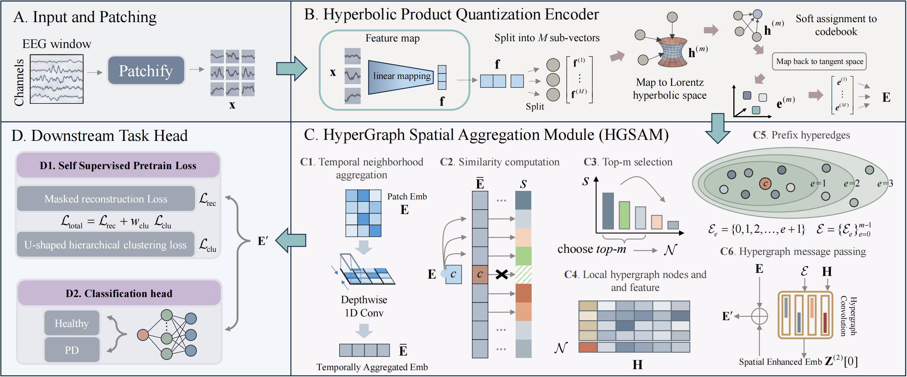

# HG-HyPCQ

**Hyperbolic Self-Supervised Pretraining for Hierarchical EEG Representation Learning in Generalizable Parkinson's Disease Detection**

**Jinghong Tang, Zhijing Wu, Yikun Liu, Wei Ju, Jiyao Wang**

[IEEE BIBM 2026](https://juweipku.github.io/publications/) | [Code](https://github.com/LCDYL/HG-HyPCQ)

HG-HyPCQ is a self-supervised framework for electroencephalography (EEG) representation learning and Parkinson's disease (PD) detection. It combines hyperbolic product quantization with adaptive hypergraph spatial aggregation to learn multi-granularity representations for cross-dataset generalization.



## Method

- **Hyperbolic product quantization.** EEG patches are encoded and quantized using learnable codebooks in a product of hyperbolic spaces. The quantized representations are mapped back to Euclidean tangent spaces.
- **HyperGraph Spatial Aggregation Module (HGSAM).** Temporal context and channel similarity define local hypergraphs for adaptive spatial aggregation.
- **Self-supervised objectives.** Masked reconstruction and U-shaped multi-granularity clustering jointly regularize the representations.

## Datasets

The paper uses three public datasets from [OpenNeuro](https://openneuro.org/):

| Dataset | PD participants | Healthy controls | Directory identifier |
| --- | ---: | ---: | --- |
| [ds002778](https://openneuro.org/datasets/ds002778/versions/1.0.5) | 15 | 16 | `2778` |
| [ds003490](https://openneuro.org/datasets/ds003490/versions/1.1.0) | 25 | 25 | `3940` |
| [ds004584](https://openneuro.org/datasets/ds004584/versions/1.0.0) | 100 | 49 | `4584` |

The paper includes all participants and uses resting-state recordings. It excludes the auditory oddball task in `ds003490` and uses off-medication recordings for `ds002778` and `ds003490`.

Prepare `.mat` files readable by `scipy.io.loadmat`. Each file contains a variable named `data` with shape `[channels, time_samples]`. Organize the processed recordings as follows:

```text
1-simple_data_process/
├── 2778/
│   ├── HC/*.mat
│   └── PD/*.mat
├── 3940/
│   ├── HC/*.mat
│   └── PD/*.mat
└── 4584/
    ├── HC/*.mat
    └── PD/*.mat
```

`HC` has label `0`, and `PD` has label `1`. The scripts use `3940` as the internal identifier for `ds003490`.

The default settings use 500 Hz recordings and 10-s windows with 75% overlap. The loaders extract windows from the first 90,000 samples per file for `2778` and `3940`, and the first 60,000 samples for `4584`. Files must satisfy these lengths, and windows in the same batch must have the same channel count. Raw-data preprocessing and format conversion take place before loading.

## Usage

Prepare a Python environment with CUDA-enabled PyTorch, PyTorch Geometric, and GPU-enabled FAISS. Pretraining requires a CUDA-capable NVIDIA GPU. Installation details are available in the [PyTorch](https://pytorch.org/get-started/locally/), [PyTorch Geometric](https://pytorch-geometric.readthedocs.io/en/latest/install/installation.html), and [FAISS](https://github.com/facebookresearch/faiss/blob/main/INSTALL.md) guides.

Install the remaining dependencies:

```bash
python -m pip install numpy scipy scikit-learn tqdm
```

Experiment settings are defined in `config.ini`, and `Train.py` provides the main entry point.

## Citation

Processing……

## License

The code is released under the [MIT License](LICENSE).
